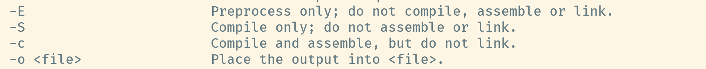

C 语言的编译过程

C 源文件 （*.c）

过程：编译 gcc 源文件 -o 可执行文件

C 可执行文件 （*.exe）

-E 表示仅预处理，生成文件

-S表示执行预处理+汇编，生成汇编文件

-c表示执行预处理+汇编+编译，生成二进制文件

什么参数都不加，表示执行预处理+汇编+编译+链接，生成可执行文件

源文件 -> 预处理 -> 汇编 -> 编译 -> 链接 -> 可执行文件

源文件：程序员编写代码的文件

预处理：#include 预处理执行在预处理阶段执行

汇编：将C语言转换为汇编语言（是二进制文件的助记符）

编译：将汇编语言转换为二进制（0、1）

链接：将二进制文件整合，生成可执行文件

> C 的源文件到可执行文件都经过哪些步骤：
>
> 预处理：执行预处理语句（#include、#if #endif、#define），移除注释（单行注释、多行注释）
>
> 汇编：语法检测
>
> 编译&链接：转换为二进制行，链接，静态库、动态库....
>
> 

C 语言（标准C语言语法）

编译器（按C语言标准来写编译器），ARMC,GNU,CLANG

平台、硬件、操作系统

内存：

